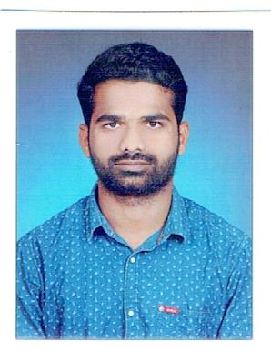

# Prudhvidhar reddy Gopireddy

I Have completed my b.tech from sri indu institute of engineering and technology in Electronic and communication engineering.Having 4+ years of IT experience in the Middleware infrastructure design, implementation, configuration, monitoring and support. Experienced in installing, configuring, patching, troubleshooting and Administration of IBM Websphere MQv7.0x& v7.5x V8.0 V9.1 and setting up the Development, Test and Production environments on Linux and Windows servers.I want to improve my knowledge skills on java and web apps and server so i have applied for computer science and present i am pursuing my masters.

